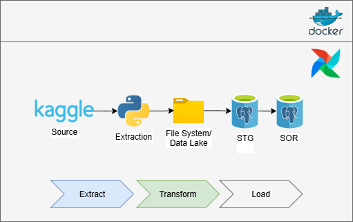
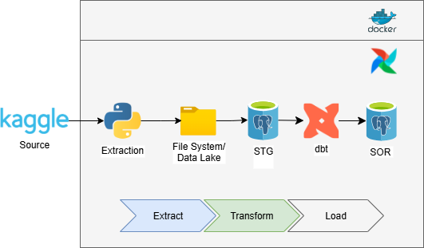
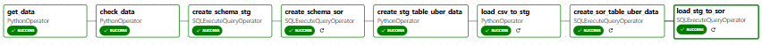
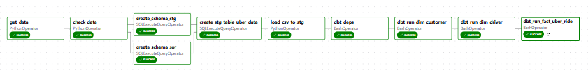

# Requirement
Docker, Docker Compose, Python, DBeaver/PgAdmin/Adminer and Code Editor.

# Airflow - Docker
## Docker Setup for Airflow
1. First download the docker-compose file by running this command in the terminal.

> curl -LfO 'https://airflow.apache.org/docs/apache-airflow/3.0.6/docker-compose.yaml'

2. docker compose up airflow-init (initialize database for airflow)
3. docker-compose up -d (run docker images)
4. docker ps  (to check status of images)
5. Create an .env file and insert `AIRFLOW_UID=50000` 

# To Access the Airflow UI
Go to your web browser and open up localhost:8080.

# Pipeline Architecture 
## DAG (Kaggle-Postgres)

Using Docker as the baseline of the architecture to run Airflow. \
Streams data from Kaggle using Kaggle Hub (Uber Ride Data) to Postgres Database. \
Implemented database schemas (STG and SOR) to handles and prepare different stages of data.

## DAG (Kaggle - Postgres - dbt - Postgres)

Implemented dbt for transforming and quality check data from staging area to sor.

# Result DAG 
## Postgre Direct

get_data >> check_data >> create_schema_stg >> create_schema_sor >> create_stg_table >> load_csv_to_stg >> create_sor_table >> load_stg_to_sor

## dbt Transform

get_data >> check_data >> create_schema_stg >> create_schema_sor >> create_stg_table >> load_csv_to_stg >> dbt_deps >> dbt_run_dim_driver >> dbt_run_dim_customer >> dbt_run_fact_booking >> dbt test

